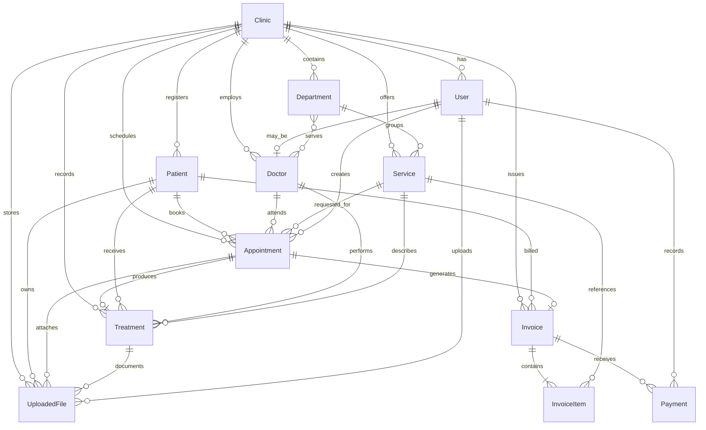

# Smile Plus Dental Clinic Data Model

All models use a `cuid()` internal primary key. Records are tenant-scoped through `Clinic` and use timestamps for auditability. Patient records support soft deletion through `isActive` and `deletedAt` while preserving historical appointments, treatments, and invoices.

## Model Notes

- `Patient.patientCode` is unique within a clinic and uses the `SML-000001` display format.
- `Appointment`, `Treatment`, `Invoice`, and `UploadedFile` keep optional links where a record may exist without the related workflow event.
- `Invoice.dueAmount` is stored for fast reads and must be recalculated when invoice items or payments change.
- `UserRole`, `AppointmentStatus`, `PaymentMethod`, and `Gender` constrain the corresponding operational values.
- Indexes cover clinic tenancy, patient lookup, appointment scheduling, invoice status, and common foreign-key access paths.
